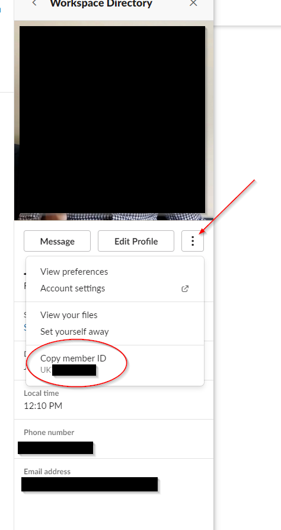

# Living Spaces eCommerce API

Micro-API for retrieving product data from Firebase. Each folder deploys on a Google Cloud Function. All functions should have "Content-Type" set to "application/json". api_key "xxxxx" should be replaced with your API key.


---

## getSkuData

**ENDPOINT:** https://us-east1-root-catfish-206221.cloudfunctions.net/sku-data

**POST** request. Send a SKU, get all associated product data. Request JSON should be formatted as follows:

```javascript
{
    "api_key": "xxxxx",
    "sku": "246776"
}
```

or multiple SKUs

```javascript
{
    "sku": "246776,100045,241982"
}
```

**SAMPLE RESPONSE** Some fields edited for security reasons

```javascript
{
  "data": {
    "246776": {
      "brandfolder360": "https://cdn.brandfolder.io/XGNU4V1E/as/pwieu0-8plmp4-8tjk2z/360_246776.jpg",
      "height": 29,
      "mattressBrand": "",
      "inStock": true,
      "features": "with Tapered Legs,Tufted,with Tight Back",
      "dcList": "xxxxx",
      "product_level4": "Sofa",
      "cartonHardwareLocated": "",
      "featuredArticles": "155598,165397,163249,159981",
      "assemblyInstructions": [],
      "searchKeywords": "chesterfieldstyle, tufted, mid century, mid century modern, tapered legs",
      "weight": 125,
      "cartonHardwareIncluded": "False",
      "breadcrumbParentID": "135268",
      "reviewsCount": "xxxxx",
      "productType_level1": "Furniture",
      "depth": 33,
      "url": "https://www.livingspaces.com/pdp-tate-ii-estate-sofa-246776",
      "countryOrigin": "Mexico",
      "tearSheets": [],
      "caProp65": "",
      "lifestyle": "Modern Living",
      "lsCategory_level2": "Upholstery",
      "secondaryWebSearchColor": "",
      "importDomestic": "Domestic",
      "lsCollectionName": "Tate II",
      "storeList": "xxxxx",
      "cartonSlatsPackaged": "",
      "buyer": "Fake Name",
      "secondaryMaterial": "",
      "lsfParcelShippable": "xxxxx",
      "investMarketing": "",
      "secondaryBaseClothType": "High Durability",
      "price": {
        "salePrice": xxxxxx,
        "msrp": xxxxx
      },
      "group_level3": "Stationary Sofa Sets",
      "romanceCopy": "Outta sight designs from the 1950s and '60s are celebrated and recreated in our Tate collection. Characterized by shelter arms, boxed tufting and brass-capped tapered legs, this mid-century style sofa goes bold in blue. Through our Special Order program, you can customize the upholstery at no extra cost and receive your piece in as little as 2 weeks.",
      "images": [
        {
          "imageGroup": "Signature",
          "imageUrl": "https://www.livingspaces.com/globalassets/productassets/200000-299999/240000-249999/246000-246999/246700-246799/246776/246776_blue_fabric_sofa_signature_1.jpg"
        },
        {
          "imageUrl": "https://www.livingspaces.com/globalassets/productassets/200000-299999/240000-249999/246000-246999/246700-246799/246776/246776_blue_fabric_sofa_front_2.jpg",
          "imageGroup": "Front"
        },
        {
          "imageGroup": "Side",
          "imageUrl": "https://www.livingspaces.com/globalassets/productassets/200000-299999/240000-249999/246000-246999/246700-246799/246776/246776_blue_fabric_sofa_side_3.jpg"
        },
        {
          "imageGroup": "Material",
          "imageUrl": "https://www.livingspaces.com/globalassets/productassets/200000-299999/240000-249999/246000-246999/246700-246799/246776/246776_blue_fabric_sofa_material_5.jpg"
        },
        {
          "imageGroup": "Detail",
          "imageUrl": "https://www.livingspaces.com/globalassets/productassets/200000-299999/240000-249999/246000-246999/246700-246799/246776/246776_blue_fabric_sofa_detail_4.jpg"
        },
        {
          "imageGroup": "Material",
          "imageUrl": "https://www.livingspaces.com/globalassets/productassets/200000-299999/240000-249999/246000-246999/246700-246799/246776/246776_blue_fabric_sofa_material_6.jpg"
        },
        {
          "imageGroup": "360",
          "imageUrl": "https://www.livingspaces.com/globalassets/images/spin.jpg"
        },
        {
          "imageGroup": "Detail",
          "imageUrl": "https://www.livingspaces.com/globalassets/productassets/200000-299999/240000-249999/246000-246999/246700-246799/246776/246776_blue_fabric_sofa_room_09.jpg"
        }
      ],
      "defaultWarehouseQty": xxxxx,
      "soConfigure": "Online + In-Store",
      "style": "Mid-Century Modern",
      "width": 92,
      "mattressType": "",
      "dropshipQty": 0,
      "whereLegsPackaged": "Attached",
      "hardKitComponent": "",
      "dropship": "xxxxxx",
      "hardwarePackageDescription": "",
      "title": "Tate II Estate Sofa",
      "noWebOrder": "xxxxx",
      "secondaryStyle": "",
      "reviewsAvg": "xxxxx",
      "partsList": [],
      "oversizedFurniture": "",
      "relatedCategoryPairs": [
        {
          "title": "Modern Tufted Sofas",
          "url": "https://www.livingspaces.com/departments/furniture/living-room/sofas-and-sectionals/sofas?features=Tufted&style=Modern"
        },
        {
          "url": "https://www.livingspaces.com/departments/furniture/living-room/sofas-and-sectionals/sofas/chesterfield-sofas",
          "title": "Chesterfield Sofas"
        },
        {
          "url": "https://www.livingspaces.com/departments/furniture/living-room/sofas-and-sectionals/sofas?features=with+Tight+Back&style=Modern",
          "title": "Modern Sofas With Tight Back"
        },
        {
          "url": "https://www.livingspaces.com/departments/furniture/living-room/sofas-and-sectionals/sofas?color_groups=blue&features=Tufted",
          "title": "Blue Tufted Sofas"
        },
        {
          "url": "https://www.livingspaces.com/departments/furniture/living-room/sofas-and-sectionals/sofas?features=with+Tight+Back",
          "title": "Tight Back Sofas"
        },
        {
          "title": "Fabric Tufted Sofas",
          "url": "https://www.livingspaces.com/departments/furniture/living-room/sofas-and-sectionals/sofas?f_material_type=Fabric&features=Tufted"
        },
        {
          "url": "https://www.livingspaces.com/departments/furniture/living-room/sofas-and-sectionals/sofas?color_groups=blue",
          "title": "Blue Sofas"
        },
        {
          "url": "https://www.livingspaces.com/departments/custom-upholstery?product_attribute=Sofa",
          "title": "Sofa Custom Upholstery"
        }
      ],
      "baseMaterial": "Fabric",
      "sizes": "",
      "pid": "246776",
      "clearance": "",
      "productStatus": "xxxxx",
      "colorFamily": "Blue",
      "sectionalBracketsIncluded": "",
      "comfortLevel": "",
      "assemblyTime": "None",
      "material": "Fabric"
    }
  }
}
```

---

## bloomreachSkusonPlp

**ENDPOINT:** https://us-central1-root-catfish-206221.cloudfunctions.net/bloomreach-skus-on-plps

**POST** request. Send PLP URL and page for request, and get back SKUs that are on the PLP. Request JSON formatting as follows:

```javascript
{
    "api_key": "xxxxx",
    "url": "https://www.livingspaces.com/departments/rugs/type/area-rugs"
}
```

**SAMPLE RESPONSE** SKUs truncated for documentation purposes

```javascript
{
    "data":
    {
        "skus": ["108064", "110488", "237178", "110487", "110483", "237162", "108374", "94830", "245009"]
    }
}
```

---

## sendSlackMessage

**ENDPOINT:** https://us-central1-root-catfish-206221.cloudfunctions.net/sendSlackMessage

**POST** request. Send user and message to route to the LS Slack Bot. `'user'` can use a name (right now only have a few set up) OR a Slack User ID:



```javascript
{
    "api_key": "xxxxxx",
    "user": "josh",
    "message": "from gcp with love"
}
```

**SAMPLE RESPONSE** Some fields edited for security reasons

```javascript
{
    "data": {
        "response": "{'ok': True, 'channel': 'xxxxx', 'ts': '1568228729.002300', 'message': {'type': 'message', 'subtype': 'bot_message', 'text': 'from gcp with love', 'ts': '1568228729.002300', 'username': 'xxxxx', 'bot_id': 'xxxxx'}}"
    }
}
```

---

## skuToInriverId

**ENDPOINT:** https://us-central1-root-catfish-206221.cloudfunctions.net/skuToInriverId

**POST** request. Send an array of sku(s) and recieve a dictionary back with key:value pairs of sku:item ID. Returns false if sku is not in database.

```javascript
{
	"api_key": "xxxxx",
	"skus": [246776, 100040, 249512]
}
```

**SAMPLE RESPONSE**

```javascript
{
    "data": {
        "246776": "468288",
        "100040": false,
        "249512": false
    }
}
```
